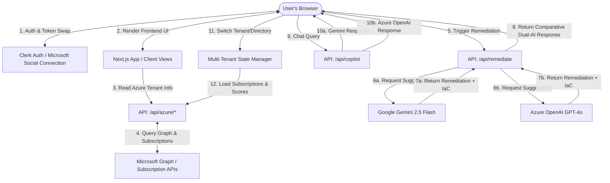

# CloudSentry PWA Dashboard

[](https://github.com/ajf013/CloudSentry/stargazers)


A premium, responsive **Progressive Web App (PWA)** built with **Next.js 16**, **Clerk OAuth**, and a **Comparative Dual AI Engine (Google Gemini 2.5 Flash + Azure OpenAI GPT-4o)** to analyze and secure your Azure subscription environment.

CloudSentry fetches real-time security posture ratings and recommendation lists directly from **Microsoft Defender for Cloud**, and generates comparative AI remediation scripts, IaC templates (Terraform & Bicep), step-by-step terminal commands, risk assessments, guided policy exemptions, and an interactive AI Security Copilot.

---

## Architecture Flow Diagram



---

## Features

| Feature | Description |
| :--- | :--- |
| 📈 **Live Posture Score** | Real-time secure score percentage and control completions from Microsoft Defender for Cloud |
| 🤖 **Dual-AI Remediation** | Side-by-side remediation plans, CLI commands, and risks from Google Gemini and Azure OpenAI GPT-4o |
| 🏗️ **IaC Generator** | One-click generation and download of Terraform & Bicep scripts for every security recommendation |
| 🤖 **AI Security Copilot** | Floating chat panel powered by Gemini + GPT-4o for interactive security Q&A and custom code generation |
| 🏢 **Multi-Tenant Switcher** | Switch between multiple Azure Active Directory tenants and organization environments from the dashboard header |
| 📊 **Historical Score Tracking** | SVG trend chart with localStorage persistence, interactive tooltips, and simulated scan controls |
| 🔑 **Multi-Tenant Azure Integration** | Uses Clerk's social connections to let users connect their own Entra ID tenants securely |
| 🔕 **Manual Exemption Guidance** | Copy-pasteable Azure CLI exemption commands for policy management without direct write access |
| 📱 **Progressive Web App (PWA)** | Offline availability, auto-update system with version-aware prompts, iOS and Android home screen installation |
| 🎨 **Obsidian Dark Theme** | Premium glassmorphic card layouts, micro-animations, and responsive breakpoints (zero Tailwind) |

---

## What's New — Recent Updates

### v1.4 — Interactive AI Security Copilot
- A floating purple gradient **Copilot launcher button** appears on the bottom right of the dashboard.
- Clicking it slides open a glassmorphic, blur-backed side panel with scrollable chat history and formatted markdown rendering.
- Powered by a new `/api/copilot` endpoint that queries both **Google Gemini** and **Azure OpenAI** in parallel — responses from each model are clearly labelled and displayed separately.
- Includes **quick-prompt chips** (e.g. *"Explain lowest score"*, *"Terraform code for public VM"*) for instant contextual analysis without typing.

### v1.3 — Automated IaC (Infrastructure-as-Code) Generator
- The remediation modal now includes a dedicated **IaC** tab alongside the existing Manual, CLI, and Exemption tabs.
- Toggle between **Terraform** (`.tf`) and **Bicep** (`.bicep`) formats to view the generated template for each recommendation.
- Click **Copy** to copy the script to clipboard, or **Download** to save the file locally.
- AI-generated scripts are produced by both Gemini and Azure OpenAI; resilient fallback boilerplate templates activate when AI is unavailable.

### v1.2 — Multi-Tenant Organization Switcher
- A new **Directory (Tenant)** dropdown appears in the dashboard header alongside the Subscription selector.
- Switching directories instantly refreshes subscriptions, secure scores, historical charts, and the full recommendation grid.
- Three pre-configured mock tenant environments (**Acme Corporate**, **Acme Retail**, **Acme Gov Cloud Sandbox**) are bundled for offline/demo use, alongside your live connected Azure directory.

### v1.1 — Historical Score Tracking & Charting
- An **SVG trend line chart** sits between the score KPI cards and the recommendation list on the dashboard.
- Scores are recorded to `localStorage` on each session and capped at the last 10 data points.
- Includes **Simulate Scan** and **Reset** controls for testing on mobile (e.g. iPhone home screen bookmark).

---

## Directory Structure

```
azure-defender-dashboard/
├── .env.local.example         # Template for all required environment variables
├── eslint.config.mjs          # ESLint configuration
├── next.config.ts             # Next.js app-level configurations
├── package.json               # App dependencies and npm scripts
├── setup-azure-app.sh         # Automated Azure AD App Registration helper
├── tsconfig.json              # TypeScript configuration
├── public/
│   ├── app-version.json       # PWA version manifest for auto-update checking
│   ├── favicon.png            # Browser tab favicon
│   ├── logo.png               # Full app branding logo
│   ├── manifest.json          # PWA app manifest (name, icons, display)
│   ├── sw.js                  # Custom Service Worker for offline PWA support
│   └── icons/
│       ├── icon-192x192.png   # PWA icon (192px)
│       └── icon-512x512.png   # PWA icon (512px)
├── src/
│   ├── proxy.ts               # Clerk Next.js middleware (proxy pattern)
│   ├── app/
│   │   ├── layout.tsx         # Root layout: theme, fonts, SW registration
│   │   ├── page.tsx           # Home landing page with Clerk OAuth integration
│   │   ├── globals.css        # Core Obsidian dark-mode CSS token system
│   │   ├── dashboard/
│   │   │   └── page.tsx       # Primary dashboard: scores, AI panel, copilot, switcher
│   │   ├── sign-in/           # Custom Clerk sign-in pages
│   │   ├── sign-up/           # Custom Clerk sign-up pages
│   │   └── api/
│   │       ├── copilot/       # AI Security Copilot (Gemini + Azure OpenAI)
│   │       ├── remediate/     # Dual-AI Remediation + IaC generator endpoint
│   │       └── azure/         # Azure tenant, subscription, and Defender data endpoints
│   └── components/
│       ├── DefenderLogo.tsx   # Official Microsoft Defender for Cloud SVG logo
│       ├── Footer.tsx         # Animated social footer (GitHub, LinkedIn, X, etc.)
│       ├── PWARegistration.tsx # PWA installer, update checker, and iOS notice
│       └── SecurityTrendChart.tsx # SVG historical score trend chart
```

---

## Quick Start Setup

### Step 1: Clone and Install Dependencies
```bash
git clone https://github.com/ajf013/CloudSentry.git
cd CloudSentry
npm install
```

### Step 2: Configure Environment Variables
```bash
cp .env.local.example .env.local
```

Fill in the following variables:

| Variable | Where to Get It |
| :--- | :--- |
| `NEXT_PUBLIC_CLERK_PUBLISHABLE_KEY` | [Clerk Dashboard](https://dashboard.clerk.com) → API Keys |
| `CLERK_SECRET_KEY` | [Clerk Dashboard](https://dashboard.clerk.com) → API Keys |
| `GEMINI_API_KEY` | [Google AI Studio](https://aistudio.google.com) |
| `NEXT_PUBLIC_AZURE_TENANT_ID` | Azure Portal → Microsoft Entra ID → Overview |
| `AZURE_CLIENT_ID` | Generated by the setup script in Step 3 |
| `AZURE_CLIENT_SECRET` | Generated by the setup script in Step 3 |
| `AZURE_OPENAI_API_KEY` | Azure Portal → Azure OpenAI resource → Keys |
| `AZURE_OPENAI_ENDPOINT` | Azure Portal → Azure OpenAI resource → Endpoint |
| `AZURE_OPENAI_DEPLOYMENT` | Your GPT-4o deployment name (e.g. `gpt-4o`) |

### Step 3: Run the Azure AD App Registration Script
```bash
az login --tenant <your-tenant-id>
./setup-azure-app.sh
```
Provide the redirect URL from your Clerk Dashboard when prompted. The script will register the app, upload the logo, and output your **Client ID** and **Client Secret**.

### Step 4: Configure Clerk Social Connections
1. Clerk Dashboard → **SSO Connections** → **Add Connection** → **Microsoft**
2. Toggle **"Use Custom Credentials"** on.
3. Paste the **Client ID** and **Client Secret** from Step 3.
4. Add the scope: `https://management.azure.com/user_impersonation`
5. Save the connection.

---

## Development & Deployment

### Run Locally
```bash
npm run dev
```
Open [http://localhost:3000](http://localhost:3000).

### Production Build Check
```bash
npm run build
```

### Deploy to Netlify
Connect your GitHub repository in the [Netlify Dashboard](https://app.netlify.com). Set the same environment variables from `.env.local` in **Site Settings → Environment Variables**, then trigger a deploy.

> **DNS**: If hosting as a subdomain via Hostinger, add a `CNAME` record pointing your subdomain to your Netlify site's default domain (e.g. `your-site.netlify.app`).

---

## Technology Stack

| Technology | Version | Badge | Purpose |
| :--- | :--- | :--- | :--- |
| **Next.js** | `16.2.6` |  | Full-stack React framework with App Router |
| **React** | `19.2.4` |  | Core UI rendering and component system |
| **TypeScript** | `5.x` |  | Type-safe development |
| **Clerk Auth** | `7.3.7` |  | Microsoft Entra ID OAuth & session management |
| **Google Gemini** | `gemini-2.5-flash` |  | AI remediation, IaC generation, Copilot responses |
| **Azure OpenAI** | `gpt-4o` |  | Comparative AI engine for remediation & Copilot |
| **Vanilla CSS** | — |  | Glassmorphic dark-mode design system (zero Tailwind) |
| **PWA** | Custom SW |  | Offline support, home screen install, auto-updates |

---

## License

This project is licensed under the **MIT License** — see the [LICENSE](LICENSE) file for details.

---

## Author

### 👤 Francis Ponnu Cruz I
> **Azure Cloud & DevOps Engineer | Microsoft Certified Trainer (MCT)**

#### 🌐 Connect with Me:
[](https://github.com/ajf013)
[](https://www.linkedin.com/in/ajf013-francis-cruz/)
[](https://x.com/Itsme_Ajf013)
[](https://fcruz.org)
[](https://linktr.ee/AJF013)
