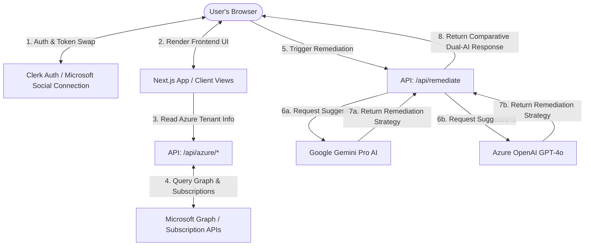

# CloudSentry PWA Dashboard

[](https://github.com/ajf013/azure-defender-dashboard/stargazers)

A premium, responsive Progressive Web App (PWA) built with **Next.js 16**, **Clerk OAuth**, and a **Comparative Dual AI Engine (Google Gemini 2.5 Flash + Azure OpenAI GPT-4o)** to analyze and secure your Azure subscription environment. It fetches real-time security posture ratings and recommendation lists directly from Microsoft Defender for Cloud and generates comparative AI remediation scripts, step-by-step terminal commands, risk assessments, and guided policy exemptions.


---

## Architecture Flow Diagram



---

## Features
- 📈 **Live Posture Score**: Instantly visualizes secure score percentages and control completions.
- 🤖 **Dual-AI Remediation (Comparative)**: Displays side-by-side remediation plans, terminal Azure CLI command blocks, and risks from Google Gemini Pro and Azure OpenAI GPT-4o in parallel panels.
- 🔑 **Multi-Tenant Azure Integration**: Uses Clerk's social connections to allow public users to connect their own tenants securely.
- 🔕 **Manual Exemption Guidance**: Provides copy-pasteable Azure CLI commands to exempt policies rather than automating writes directly, keeping the tenant secure.
- 📱 **Progressive Web App (PWA)**: Fast load times, offline availability, and native app installations across Desktop, iOS, and Android.
- 🎨 **Obsidian Dark CSS Theme**: High-end glassmorphic card layouts, responsive layouts, micro-animations, and styled settings.

---

## Directory Structure

```
azure-defender-dashboard/
├── .env.local.example       # Template for configuration keys
├── eslint.config.mjs        # Linter configuration
├── next.config.ts           # Next.js configurations
├── package.json             # App dependencies and scripts
├── setup-azure-app.sh       # Azure AD app registration helper script
├── tsconfig.json            # TypeScript configuration
├── public/                  # Static assets and PWA configuration
│   ├── favicon.png          # App tab favicon
│   ├── logo.png             # Branding logo
│   ├── manifest.json        # PWA app manifest
│   ├── sw.js                # Custom PWA Service Worker for offline support
│   └── icons/               # PWA icon files
│       ├── icon-192x192.png # Resized 192x192 logo
│       └── icon-512x512.png # Resized 512x512 logo
├── src/
│   ├── proxy.ts             # Clerk Next.js middleware (proxy pattern)
│   ├── app/                 # Next.js App Router folders
│   │   ├── layout.tsx       # Root layout, theme, and service worker checks
│   │   ├── page.tsx         # Home landing page with Clerk integration
│   │   ├── globals.css      # Core Dark-Mode Obsidian style tokens
│   │   ├── dashboard/       # Dashboard routes
│   │   │   └── page.tsx     # Centralized posture list and dual-AI panel
│   │   ├── sign-in/         # Custom Clerk sign-in routes
│   │   ├── sign-up/         # Custom Clerk sign-up routes
│   │   └── api/             # Backend API endpoint routes
│   │       ├── remediate/   # Gemini + Azure OpenAI Comparative API
│   │       └── azure/       # Azure subscription and tenant endpoints
│   └── components/          # Reusable react components
│       ├── DefenderLogo.tsx # Official Microsoft Defender SVG logo
│       ├── Footer.tsx       # Premium social footer
│       └── PWARegistration.tsx # PWA installer and notification toast
```

---

## Quick Start Setup

### Step 1: Clone and Install Dependencies
Run from the root of the project:
```bash
npm install
```

### Step 2: Configure Environment Variables
Copy `.env.local.example` to `.env.local`:
```bash
cp .env.local.example .env.local
```
Fill in the following variables:
- `NEXT_PUBLIC_CLERK_PUBLISHABLE_KEY` & `CLERK_SECRET_KEY`: Get these from your [Clerk Dashboard](https://dashboard.clerk.com).
- `GEMINI_API_KEY`: Get a free key from [Google AI Studio](https://aistudio.google.com).
- `NEXT_PUBLIC_AZURE_TENANT_ID`: The default Azure Active Directory tenant ID.
- `AZURE_CLIENT_ID` & `AZURE_CLIENT_SECRET`: Generated in Step 3.
- `AZURE_OPENAI_API_KEY`, `AZURE_OPENAI_ENDPOINT` & `AZURE_OPENAI_DEPLOYMENT`: Active Azure OpenAI GPT-4o model deployments.

### Step 3: Run the Azure AD App Registration Script
We have included an automated helper script to configure the Microsoft Entra ID (Azure AD) App Registration with proper user impersonation permissions:
1. Log in to the Azure CLI on your local machine:
   ```bash
   az login --tenant <your-tenant-id>
   ```
2. Execute the helper script:
   ```bash
   ./setup-azure-app.sh
   ```
3. Provide the redirect URL given by your Clerk Dashboard.
4. The script will register the application, update the branding/description, upload the custom vector logo, and generate your **Client ID** and **Client Secret**.

### Step 4: Configure Clerk Social Connections
1. Go to your **Clerk Dashboard** > **SSO Connections** > **Add Connection**.
2. Select **Microsoft** and toggle **"Use Custom Credentials"** on.
3. Paste the **Client ID** and **Client Secret** generated in Step 3.
4. Add the following scope to the configuration:
   `https://management.azure.com/user_impersonation`
5. Save the connection.

---

## Development and Deployment

### Run Locally
To boot up the development server:
```bash
npm run dev
```
Open [http://localhost:3000](http://localhost:3000) to view the dashboard.

### Build and Compile Checks
To verify production readiness:
```bash
npm run build
```

---

## Technology Stack

| Technology | Version / Model | Icon / Badge | Description / Purpose |
| :--- | :--- | :--- | :--- |
| **Next.js** | `v16.2.6` |  | Full-stack React framework (App Router & server-side API routes) |
| **React** | `v19.2.4` |  | Core UI render engine & components library |
| **TypeScript** | `v5.x` |  | Type-safe static analysis and coding conventions |
| **Clerk Auth** | `v7.3.7` |  | Multi-tenant user login & custom Entra ID credential mapping |
| **Google Gemini** | `gemini-2.5-flash` |  | AI remediation instruction generator (via `@google/genai` SDK `v2.4.0`) |
| **Azure OpenAI** | `gpt-4o` |  | AI comparative suggestion engine (via direct REST API endpoint calls) |
| **Styling** | Vanilla CSS |  | Premium glassmorphism dark-mode theme (zero Tailwind dependencies) |
| **PWA** | Custom SW |  | Offline fallback & native desktop/mobile application installations |


---

## License

This project is licensed under the **MIT License** - see the LICENSE file for details.

---

## Author

### 👤 Francis Ponnu Cruz I
> **Azure Cloud & DevOps Engineer | Microsoft Certified Trainer (MCT)**

#### 🌐 Connect with Me:
[](https://github.com/ajf013)
[](https://www.linkedin.com/in/ajf013-francis-cruz/)
[](https://x.com/Itsme_Ajf013)
[](https://fcruz.org)
[](https://linktr.ee/AJF013)

